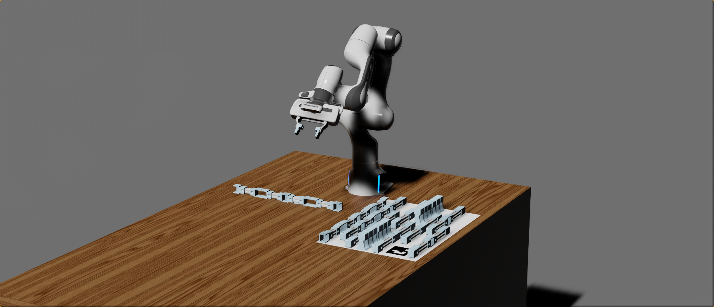

# RAMP - Sim: A Benchmark for Evaluating Robotic Assembly Manipulation and Planning
A repository containing the simulation component of the assembly benchmark



## Dependencies

There are two dependencies for ramp-sim:
- Nvidia Isaac 2022.2.1
- The Planner found [here](https://github.com/applied-ai-lab/planner)

## Installation

There are two options for installing and running the simulation, (i) locally, or (ii) in a Docker container.

### Locally 

1. Clone this repository
```
git clone --recursive --branch main git@github.com:applied-ai-lab/RAMP-SIM.git
cd RAMP-SIM
git submodule update --init --recursive

```
2. Install Nvidia Isaac locally following the guide [here](https://docs.omniverse.nvidia.com/app_isaacsim/app_isaacsim/install_workstation.html)
3. Follow the instructions to install the planner from [here](https://github.com/applied-ai-lab/planner)

### Docker 

1. Clone this repository
```
git clone --recursive --branch main git@github.com:applied-ai-lab/RAMP-SIM.git
cd RAMP-SIM
git submodule update --init --recursive

```
2. Follow the guide to install the containerised Nvidia Isaac from [here](https://docs.omniverse.nvidia.com/app_isaacsim/app_isaacsim/install_container.html)
3. Build the docker container from the dockerfile 
```
docker build -t isaac_ramp .
```

## To Run

### Locally

```
/$USER/pkg/isaac_sim-2022.2.1/python.sh scripts/main.py
```

### Docker

```
/isaac-sim/python.sh scripts/main.py
```


## Current Limitations

1. The joint limits have been increased for task-based motion planning. The Nvidia Isaac motion planner would often fail to generate feasible trajectories. 


## List of improvements to make

1. Transforms in /core/utils/transforms.py to be w,x,y,z
2. Fiducial markers to be added to the joints
3. Add noise to observations
4. Incorporate April tag detection
5. Instead of relying on a pre-built USD, create a script for procedural generation
   1. Requires finger tips to be added to the Panda
   2. Requires ee xform and rigid joint to be added to Panda
   3. Seperately load each of the meshes in and add joints, SDF collisions, etc.


## Future Roadmap

- [ ] Procedural environment generation
- [ ] Procedural beam and assembly generation
- [ ] Incorporate Nvidia Orbit for learning in parallel environments 